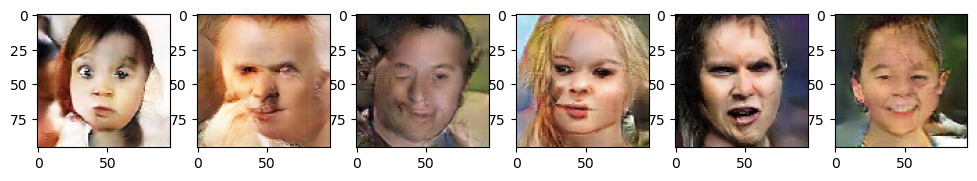
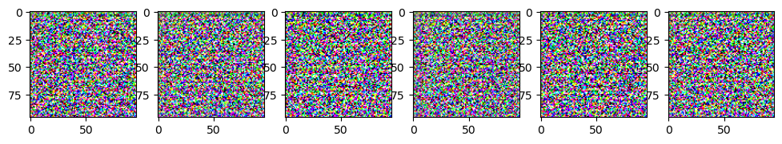
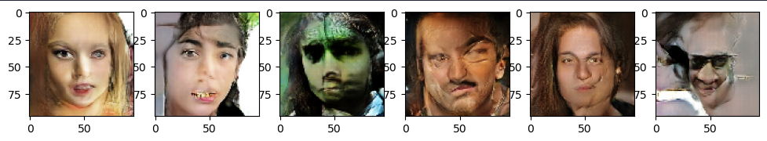
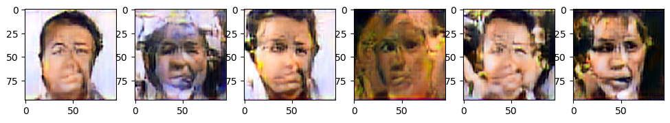
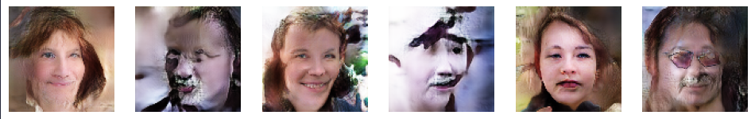
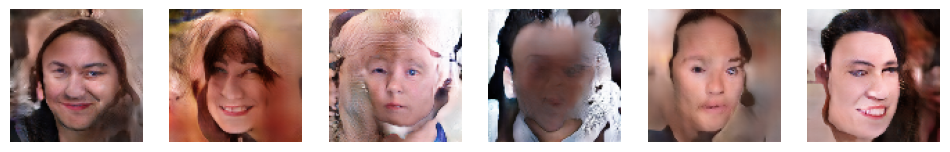

# GAN Experiments

These are experiments of trying to train GANS from scratch.

Each notebook has all the code needed to train GAN. There are 4 notebooks that differ in techniques used for training.

Below are results.

### Vanilla

### Minibatch Discrimination

### Augmenting images

### Multiscale gradient + pixelwise norm + minibatch std + equalized learning + relativistic hinge loss

### DCGAN

### DCGAN + Spectral Norm

